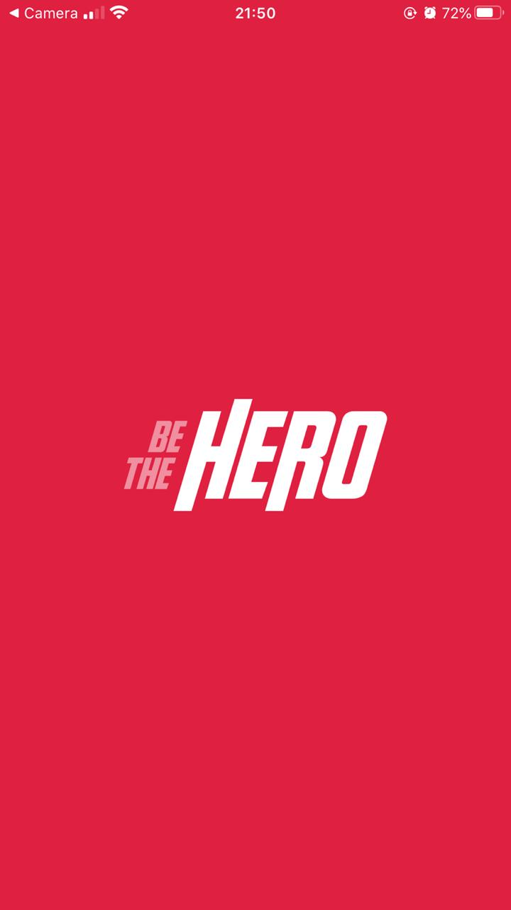
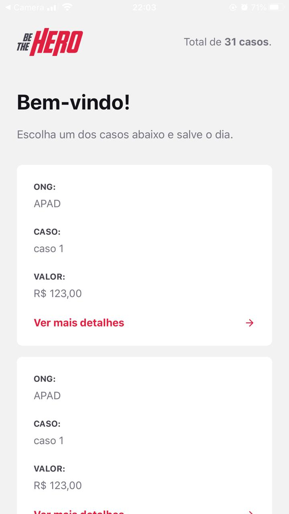

# :computer: Aplicação Mobile em React Native para mostrar os casos das ONGs oa herois

## Tecnologias

- @react-native-community/masked-view
- @react-navigation/native
- @react-navigation/stack
- axios
- expo
- expo-constants
- expo-mail-composer
- intl
- react
- react-dom
- react-native
- react-native-gesture-handler
- react-native-reanimated
- react-native-safe-area-context
- react-native-screens
- react-native-web

## Run

- git clone
 - yarn
 - yarn start
